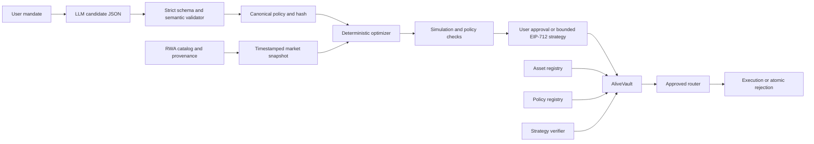

# ALIVE

## Tell ALIVE what you want your money to do.

ALIVE is an AI-native intelligence and policy layer for tokenized real-world
assets. It is being designed to translate a natural-language financial mandate
into a strict policy, evaluate eligible RWAs using sourced data, construct a
deterministic compliant portfolio, and let a user-owned smart-contract vault
enforce the approved rules.

> AI interprets. Code calculates. Smart contracts enforce.

ALIVE is not a generic investment chatbot. The model may explain and propose,
but it may not choose arbitrary transaction calldata, bypass portfolio limits,
use unapproved assets, ignore stale data, or take unrestricted custody.

## Current status

This repository is in a **strategic V2 pivot**, not a finished RWA release.

| Product line                          | Status                    | Honest boundary                                                                                                                                         |
| ------------------------------------- | ------------------------- | ------------------------------------------------------------------------------------------------------------------------------------------------------- |
| V2: RWA intelligence and policy vault | IN PROGRESS               | Shared intelligence foundations and locally tested policy-vault contracts now exist. The complete mandate-to-vault application flow is not working yet. |
| V1: Proof of Physical State           | ARCHIVED, WORKING LOCALLY | The camera/verifier/attestation/physical-escrow MVP passed its documented local generated-media flow. It is no longer the primary product.              |

The V1 checkpoint is tag `v0.8.1-physical-state-archive` at commit `bf449f6`.
The active rebuild branch is `feat/rwa-intelligence-pivot`.

There is currently:

- no complete V2 AI policy compiler;
- no accepted V2 frontend flow;
- no complete local V2 mandate-to-execution-to-rebalance proof;
- no V2 deployment on X Layer Testnet;
- no V2 contract address or transaction hash to publish;
- no basis for calling the pivot hackathon-ready.

Track exact evidence in [docs/BUILD_STATUS.md](docs/BUILD_STATUS.md) and the
product decision in [docs/PIVOT.md](docs/PIVOT.md).

## Product thesis

As tokenized Treasuries, funds, equities, gold, commodities, and credit products
move onchain, access alone is not enough. Users need to decide what they should
own, how much, which issuers they are exposed to, how liquid the portfolio is,
and what an AI is permitted to do when conditions change.

ALIVE's core differentiator is a user-defined constitution:

```text
USER MANDATE
-> CANDIDATE AI INTERPRETATION
-> STRICT POLICY
-> SOURCED RWA INTELLIGENCE
-> DETERMINISTIC PORTFOLIO
-> SIMULATION
-> USER-OWNED VAULT
-> CONTRACT ENFORCEMENT
-> MONITOR AND REBALANCE
```

A request such as `put 100% into tNVDA` may be interpreted and displayed, but a
vault with a 20% single-asset cap must reject it. The rejection must be a real
contract revert, not a frontend warning.

## Trust model

The product must visibly distinguish:

| Label        | Meaning                                                        |
| ------------ | -------------------------------------------------------------- |
| AI opinion   | A fallible interpretation, summary, comparison, or explanation |
| Policy rule  | A user-approved deterministic constraint                       |
| Market data  | A provider-labelled value with provenance and timestamp        |
| Onchain fact | Contract state, event, receipt, or revert                      |

Demo quotes must say `DEMO DATA - NOT LIVE MARKET DATA`. Missing issuer or
product facts remain `UNKNOWN`. ALIVE does not promise returns, beat the market,
or describe any investment as risk-free.

## V2 architecture



See [docs/ARCHITECTURE.md](docs/ARCHITECTURE.md) for target boundaries and
[docs/SECURITY.md](docs/SECURITY.md) for the security model.

## Repository map

| Path                     | Responsibility and current state                                                                        |
| ------------------------ | ------------------------------------------------------------------------------------------------------- |
| `apps/web`               | Next.js, wagmi/viem, visualization, and transaction UX. V2 route/content rebuild is pending acceptance. |
| `packages/shared`        | Runtime schemas, canonical encoding, policy/RWA/market/strategy types, and shared chain configuration.  |
| `packages/policy-engine` | Strict policy validation and clearly labelled deterministic mandate fallback.                           |
| `packages/market-data`   | Tested demo provider plus a fail-closed, server-side Chainlink Data Streams adapter.                    |
| `packages/optimizer`     | Tested deterministic allocation, drift detection, and rebalance proposal logic.                         |
| `packages/contracts`     | V1 contracts plus locally tested V2 registry, strategy verifier, user-owned vault, and labelled mocks.  |
| `services/intelligence`  | Tested Fastify policy, catalog, market, optimizer, policy-check, and rebalance API with SQLite storage. |
| `services/verifier`      | Legacy V1 physical-image verifier; retained for archive/regression, not V2 RWA intelligence.            |
| `videos/alive-launch`    | Legacy V1 Remotion composition. A V2 video will follow the working core.                                |
| `docs`                   | Pivot, architecture, security, build ledger, legacy references, and deployment guidance.                |

The repository is not being reorganized merely to match a diagram. Working
infrastructure is reused where it has a clear V2 responsibility.

## Prerequisites

- Node.js 22 or newer
- pnpm 11.1.2
- an EVM wallet for contract interactions
- a local Hardhat node for deterministic contract work
- Ollama only when the local `ollama` provider mode is enabled
- test OKB only for an explicitly approved X Layer Testnet deployment

No paid AI API, database, or market-data subscription is required for the
zero-cost demo path.

## Install

```bash
corepack enable
pnpm install --frozen-lockfile
```

The workspace explicitly allows install scripts only for the reviewed native
dependencies in `pnpm-workspace.yaml`. Do not bypass that allowlist to make CI
green.

## Environment

Use the committed templates; never commit filled secrets:

```powershell
Copy-Item .env.example .env
Copy-Item apps/web/.env.example apps/web/.env.local
Copy-Item packages/contracts/.env.example packages/contracts/.env
```

The root file is a template, not an implicit monorepo-wide loader. Load values
into the shell that starts a process, or use the package-local file that process
supports.

Near-zero-cost V2 defaults are intended to be:

```dotenv
LLM_PROVIDER=disabled
LLM_MODEL=
LLM_BASE_URL=http://127.0.0.1:11434
LLM_API_KEY=

MARKET_DATA_PROVIDER=demo
DEMO_MARKET_DATA_ENABLED=true

CHAINLINK_DATA_STREAMS_ENABLED=false
CHAINLINK_DATA_STREAMS_USERNAME=
CHAINLINK_DATA_STREAMS_PASSWORD=
CHAINLINK_DATA_STREAMS_ENDPOINT=
```

`LLM_PROVIDER=disabled` must produce an honest `AI COMPILER OFFLINE` state.
Chainlink and LLM credentials stay server-side and never receive a
`NEXT_PUBLIC_` prefix.

Legacy V1 verifier/signing settings remain in the templates during the archive
transition. They do not configure the new RWA policy product.

## Development

Run the web app alone:

```bash
pnpm dev:web
```

Run the V2 intelligence service (defaults to the non-AI fallback and demo
market data unless environment variables select another provider):

```bash
pnpm --filter @alive/intelligence dev
```

Run the current compatibility development stack:

```bash
pnpm dev
```

`pnpm dev` still starts the legacy physical verifier alongside the web app
during the transition. That is a compatibility path, not proof that a V2 AI or
market-data service is running.

For contracts:

```bash
pnpm chain
pnpm test:contracts
pnpm --filter @alive/contracts deploy:rwa:local
```

The RWA deployment script creates only a synthetic demo stack. Do not deploy V2
contracts to a public network until the local contract suite,
deployment export, frontend configuration, and security checklist are aligned.

## Quality gates

```bash
pnpm lint
pnpm typecheck
pnpm test
pnpm test:contracts
pnpm build
pnpm check
```

The GitHub workflow contains explicit install, lint, typecheck, workspace test,
contract test, and production-build gates. Historical public runs are red at
the frozen install step; the pivot includes a source correction to the pnpm 11
build allowlist. Do not call CI green until a new pushed workflow run passes.

The retained `pnpm smoke:local` command proves the archived V1 generated-media
settlement chain. It is useful as a regression but does not count as V2 RWA
acceptance.

## Target product routes

The V2 information architecture is:

- `/` — new product story
- `/create` — mandate entry and policy compilation
- `/policy/[policyId]` — approved normalized policy and versions
- `/markets` — provenance-aware RWA discovery
- `/assets/[assetId]` — RWA asset passport
- `/dashboard` — holdings, policy health, issuer exposure, and freshness
- `/vault/[vaultAddress]` — custody, policy, and execution state
- `/rebalance` — drift diagnosis, simulation, and corrective proposal
- `/attack-lab` — real policy/freshness/replay rejection scenarios
- `/protocol` — system and trust boundaries
- `/demo` — describe, compile, build, attack, and rebalance presentation flow
- `/dev/design-system` — development-only visual inventory

Legacy `/assets/register`, `/verify/[assetId]`, and physical `/escrow/*` routes
must leave primary navigation and must not be confused with the new product.

## X Layer state

| Network         | Chain ID | V2 status                                                             |
| --------------- | -------: | --------------------------------------------------------------------- |
| Local Hardhat   |    31337 | Target for deterministic V2 tests; complete V2 flow not yet recorded  |
| X Layer Testnet |     1952 | No V2 deployment or V2 transaction evidence                           |
| X Layer Mainnet |      196 | Configuration only; prohibited before audit and operational hardening |

The previously confirmed X Layer Testnet `AliveAssetRegistry` deployment belongs
to V1. It is preserved in the historical audit and must not be described as a
V2 policy-vault deployment.

Before any future X Layer deployment, verify current RPC and explorer details
against official X Layer documentation, use a dedicated testnet deployer,
record every address and receipt, and verify deployed bytecode/source.

## V1 archive

V1 implemented this local chain:

```text
authenticated camera registration
-> deterministic physical fingerprint
-> onchain asset commitment
-> funded physical-state escrow
-> ordered three-frame challenges
-> computed confidence and reason codes
-> short-lived EIP-712 attestation
-> contract validation
-> exact test-token payout
```

The 2026-08-12 audit recorded 108 passing tests and one complete
runtime-generated local positive path, alongside honest limitations: no reliable
real-world wrong-object benchmark, no complete public X Layer settlement, a
central verifier, and camera-only presentation risks.

Check out the preserved source without rewriting history:

```bash
git switch --detach v0.8.1-physical-state-archive
```

Return to the pivot branch with:

```bash
git switch feat/rwa-intelligence-pivot
```

Read the retained
[historical physical-state audit](docs/BUILD_STATUS.md#historical-v1-physical-state-audit)
before making any V1 claims.

## Security and product honesty

ALIVE can enforce only the rules actually encoded and tested. It cannot prove
that an issuer will honor redemption, that a source document is correct, that a
market feed captures fair value, or that a risk model predicts losses.

The V2 source is unaudited and not suitable for valuable assets. A compromised
model, signer, frontend, provider, router, token, administrator, or user device
must be considered. Read [docs/SECURITY.md](docs/SECURITY.md) before running any
contract deployment.

## Milestones

1. P1 — pivot architecture and archive
2. P2 — policy compiler, schema, hash, and approval UI
3. P3 — RWA catalog, provenance, intelligence, and passports
4. P4 — deterministic optimizer and risk engine
5. P5 — policy registry, strategy verifier, and user-owned vault
6. P6 — clearly labelled mock RWA execution
7. P7 — contract-backed policy Attack Lab
8. P8 — complete X Layer Testnet evidence chain
9. P9 — V2 frontend, Three.js, and Remotion rebuild
10. P10 — hackathon release

Only tag a milestone after its tests, runtime evidence, documentation, and Git
state agree.

## License

The repository is available under the [MIT License](LICENSE).
