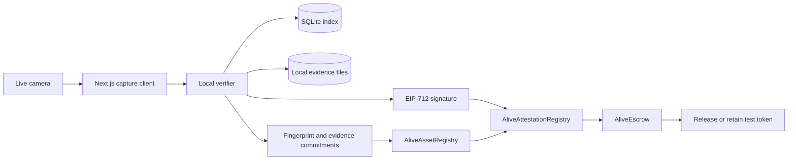

# ALIVE

## Give smart contracts eyes.

ALIVE is an experimental Proof-of-Physical-State protocol. It compares fresh camera observations of a physical asset with a private registration fingerprint, produces an expiring EIP-712 attestation, and lets an escrow contract release or withhold test-token payment from the signed result.

> Physical capture -> local vision analysis -> signed attestation -> contract validation -> payment outcome


ALIVE is infrastructure for AI-enabled real-world assets, not an NFT marketplace and not a generic image classifier. Tokenization can answer who owns a digital representation. ALIVE asks whether the physical object being presented still resembles the registered object and whether the presentation satisfies an active challenge.

## Current status

The repository contains the local MVP implementation: guided camera capture, owner-signed verifier authorization, hashed resource capabilities, an offchain fingerprint and three-frame-burst verification service, fingerprint-bound EIP-712 attestations, three Solidity protocol contracts, a six-decimal test token, a Next.js product surface, an adversarial Attack Lab, and a 40-second Remotion launch composition.

An exact-build `AliveAssetRegistry` is now live on X Layer Testnet. The remaining registry, escrow, test token, and consumer authorization are not live: the OKX Agentic Wallet left those writes pending without transaction hashes and later rejected new testnet writes before broadcast with `may_be_out_of_gas`. The checked-in [partial deployment export](packages/contracts/deployments/1952.json) records only the confirmed contract; the product remains local-by-default until the complete public deployment and smoke test finish. The exact validation state is tracked in [docs/BUILD_STATUS.md](docs/BUILD_STATUS.md).

## Why it exists

A blockchain can verify balances, ownership records, and transactions. It cannot directly observe whether a laptop still exists, whether a similar unit was substituted, whether a serial label changed, or whether an inspection is fresh. ALIVE turns observable physical evidence into a bounded, machine-readable statement that an EVM contract can consume.

The hackathon escrow demonstrates the consequence:

1. An owner authorizes an owner-and-nonce-derived asset ID, registers a physical baseline, and commits its fingerprint hash.
2. A buyer creates and funds escrow for that asset.
3. The verifier issues four randomized, ordered camera challenges.
4. The registered owner signs the exact session intent, including its asset and escrow context.
5. Each challenge supplies a fresh three-frame burst for server-observed motion and visual analysis.
6. Local computer vision computes identity, liveness, and visual-integrity scores with reason codes.
7. A server-only key signs the result as short-lived EIP-712 data.
8. `AliveEscrow` checks the fingerprint commitment, exact asset, seller, escrow context, signature, post-funding freshness, expiry, verdict, and buyer-selected thresholds.
9. A valid proof releases the exact test-token amount; a rejected proof leaves it locked.

No UI code hardcodes a passing score or invents a transaction.

## System architecture



Raw media, OCR output, and feature vectors stay offchain. X Layer receives compact commitments, basis-point scores, timestamps, and settlement state. See [architecture](docs/ARCHITECTURE.md), [scoring](docs/SCORING.md), and the [security model](docs/SECURITY.md).

## What the verifier actually measures

The default offline path uses real, deterministic image processing with no paid API:

- frames normalized to `192 x 192` with Sharp;
- blur and exposure rejection;
- spatial RGB histogram embeddings;
- local gradient-orientation descriptors;
- 64-bit perceptual hashes for exact and near-replay risk;
- corresponding-view and multi-view agreement;
- ordered challenge completion, timing, freshness, motion inside each three-frame burst, and motion between challenges;
- normalized identifier comparison when registration metadata or OCR is available.

Optional local enrichment is lazy-loaded and cached:

- `tesseract.js` for English OCR;
- `@huggingface/transformers` image-feature extraction with `Xenova/clip-vit-base-patch32` by default.

Neural inference and OCR are opt-in because the first run may download model data. If either cannot load, the verifier reports its available capabilities and continues with deterministic visual signals; it does not substitute fixed scores. The current neural output helps view-pair selection and is exposed as a diagnostic signal, but the aggregate identity policy is still weighted from spatial, local-feature, identifier, and multi-view scores. This distinction matters when evaluating the MVP.

## Repository map

| Path                  | Responsibility                                                                                                    |
| --------------------- | ----------------------------------------------------------------------------------------------------------------- |
| `apps/web`            | Next.js App Router UI, camera workflows, wagmi/viem transactions, Three.js visuals, demo and Attack Lab           |
| `services/verifier`   | Fastify API, SQLite migrations, evidence storage, feature extraction, liveness analysis, scoring, EIP-712 signing |
| `packages/shared`     | Strict Zod schemas, canonical JSON commitments, score policy, chain definitions, attestation helpers              |
| `packages/contracts`  | Asset registry, attestation registry, escrow, test token, deployments, adversarial tests                          |
| `videos/alive-launch` | Independently renderable 1920 x 1080 Remotion launch composition                                                  |
| `storage`             | Ignored local database and raw evidence directories                                                               |
| `docs`                | Architecture, API, demo, scoring, deployment, security, assets, decisions, and build ledger                       |

## Product routes

- `/` protocol story and scanner-led hero
- `/dashboard` locally remembered and verifier-returned assets
- `/assets/register` eight-stage, six-view registration
- `/assets/[assetId]` asset passport and inspection timeline
- `/verify/[assetId]` fresh active verification
- `/escrow/create` onchain escrow creation
- `/escrow/[escrowId]` approve, fund, verify, and settle from contract state
- `/attack-lab` real static-photo, substitution, expiry, and genuine-control experiments
- `/protocol` interactive trust-boundary map
- `/demo` presentation console and reset entry point
- `/dev/design-system` visual-system test page

## Prerequisites

- Node.js 22 or newer
- pnpm 11.1.2, normally through Corepack
- Chromium, Chrome, Edge, or another browser with `getUserMedia`
- a webcam or phone camera exposed to the browser
- an injected EVM wallet for onchain steps
- test OKB only when deploying to X Layer Testnet

Foundry is optional. Hardhat is the supported contract runner in this Windows workspace, and the Solidity layout remains Forge-compatible.

## Install

```bash
corepack enable
pnpm install
```

Do not install with `--no-optional` if you want the optional OCR/neural path or the native packages used by the supported toolchain.

## Environment

Copy the canonical template and replace only development values:

```powershell
Copy-Item .env.example .env
```

The root `.env` is a template, not an implicit monorepo-wide loader. Before using root scripts, load it into the current shell so the child web, verifier, and deployment processes inherit the same values.

PowerShell:

```powershell
Get-Content .env | Where-Object { $_ -match '^[A-Z0-9_]+=' } | ForEach-Object {
  $name, $value = $_ -split '=', 2
  [Environment]::SetEnvironmentVariable($name, $value, 'Process')
}
```

Bash-compatible shells:

```bash
set -a
. ./.env
set +a
```

Alternatively, put public browser values in `apps/web/.env.local` and Hardhat values in `packages/contracts/.env`, then export the verifier's server-only values in its process shell.

Never place `ALIVE_VERIFIER_PRIVATE_KEY` or `DEPLOYER_PRIVATE_KEY` in a `NEXT_PUBLIC_` variable. `.env`, local evidence, SQLite files, model binaries, and rendered videos are ignored by Git.

## Fastest offchain run

This exercises real camera capture, persistence, fingerprinting, challenge generation, and scoring without claiming an onchain result:

```bash
pnpm dev
```

Open `http://localhost:3000`, choose local capture mode, and register an object. The verifier listens on `http://127.0.0.1:4100`. Local mode still signs the short-lived wallet-authorization typed data with its ephemeral session key. Verifier attestation issuance remains unavailable until a valid server signing key, chain ID, and attestation-registry address are configured.

## Complete local protocol run

Use three terminals.

### 1. Start the local EVM chain

```bash
pnpm chain
```

The Hardhat node prints development accounts and keys. Use only its disposable account 1 key as the local verifier key. Never fund or reuse that key on a public network.

### 2. Deploy contracts

With `VERIFIER_ADDRESS` unset, local deployment authorizes Hardhat account 1 and deploys `MockUSDT` automatically:

```bash
pnpm deploy:local
```

The script prints addresses and writes `packages/contracts/deployments/31337.json`. It deliberately refuses to overwrite an existing export. Put the returned values into `.env`:

```dotenv
ALIVE_VERIFIER_PRIVATE_KEY=0xLOCAL_HARDHAT_ACCOUNT_1_PRIVATE_KEY
ALIVE_CHAIN_ID=31337
ALIVE_ATTESTATION_REGISTRY_ADDRESS=0x...
ALIVE_AUTH_AUDIENCE=http://127.0.0.1:4100
ALIVE_AUTH_CHAIN_ID=31337

NEXT_PUBLIC_CHAIN_ENV=local
NEXT_PUBLIC_RPC_URL=http://127.0.0.1:8545
NEXT_PUBLIC_ASSET_REGISTRY_ADDRESS=0x...
NEXT_PUBLIC_ATTESTATION_REGISTRY_ADDRESS=0x...
NEXT_PUBLIC_ESCROW_ADDRESS=0x...
NEXT_PUBLIC_TEST_TOKEN_ADDRESS=0x...
```

Reload the environment after editing.

### 3. Start the product

```bash
pnpm dev
```

Import disposable Hardhat accounts into the browser wallet, add chain `31337` with RPC `http://127.0.0.1:8545`, and keep buyer and seller accounts distinct. The seller signs the verifier's exact registration and verification-session authorizations. Registration must then be submitted onchain by that same owner. Escrow creation validates that its seller currently owns the registered asset.

To mint clearly labelled local test tokens to the buyer, open a Hardhat console:

```bash
pnpm --filter @alive/contracts exec hardhat console --network localhost
```

Then run, replacing both values from the deployment and wallet:

```javascript
const token = await ethers.getContractAt("MockUSDT", "0xTOKEN_ADDRESS");
await token.mint("0xBUYER_ADDRESS", 10000n * 10n ** 6n);
```

The token is `ALIVE Test USDT` (`tUSDT`), has six decimals, and has no value or Tether affiliation.

## X Layer Testnet

X Layer Testnet uses chain ID `1952`, OKB for gas, the public RPC `https://testrpc.xlayer.tech/terigon`, and the OKX explorer at `https://www.okx.com/web3/explorer/xlayer-test`.

Deployment requires two dedicated secrets or identities:

- a deployer key funded with test OKB;
- a separate verifier key whose public address is passed as `VERIFIER_ADDRESS`.

```bash
pnpm deploy:testnet
```

The deployment script creates the asset registry, attestation registry, and escrow; authorizes that escrow as a contextual attestation consumer; optionally deploys the clearly labelled mock token; and writes `packages/contracts/deployments/1952.json`. It does not verify source code on the explorer automatically. Follow the full [X Layer deployment and smoke-test guide](docs/XLAYER_DEPLOYMENT.md) before committing an address export or calling a release deployed.

| Network         | Chain ID | Deployment state                                                                                                                                                  |
| --------------- | -------: | ----------------------------------------------------------------------------------------------------------------------------------------------------------------- |
| Local Hardhat   |    31337 | Generated per local run; export is ignored                                                                                                                        |
| X Layer Testnet |     1952 | Partial: [`AliveAssetRegistry`](https://www.okx.com/web3/explorer/xlayer-test/address/0x036caD7F90A8A7ecf9B918dc214659aCb3D07Ab9) confirmed; no public escrow yet |
| X Layer Mainnet |      196 | Configuration only; unaudited and not deployed                                                                                                                    |

Confirmed X Layer Testnet transaction: [`0xcf1027...574883`](https://www.okx.com/web3/explorer/xlayer-test/tx/0xcf102772641d7a061709295a3679676cf24c90ad2917e6541ebc9accb5574883). Direct RPC readback returned 2,123 bytes of runtime code, exactly equal to the compiled `AliveAssetRegistry` artifact. This is evidence of one contract deployment, not a complete ALIVE testnet release.

## API workflow

The authoritative HTTP sequence is:

```text
POST /api/auth/challenge                     CREATE_ASSET intent
SIGN AliveAuthorization                     owner wallet or local ephemeral signer
POST /api/assets                            consumes authorization, returns capability
POST /api/assets/:assetId/captures          bearer capability, one registration frame per view
POST /api/assets/:assetId/fingerprint       bearer capability, finalizes and revokes it
POST /api/auth/challenge                     CREATE_VERIFICATION_SESSION intent
SIGN AliveAuthorization                     authenticated asset owner only
POST /api/verifications/session             consumes authorization, returns capability
POST /api/verifications/:sessionId/capture  bearer capability, three frames per challenge
POST /api/verifications/:sessionId/analyze  bearer capability
POST /api/verifications/:sessionId/attestation bearer capability
```

For asset creation, `authorization.resource` is
`keccak256(abi.encode(owner, authorization.nonce))`. The same signed nonce is
passed to the onchain registry, preventing another caller from claiming that
offchain asset ID. The verifier stores one-time authorization nonces and only
Keccak hashes of the random bearer capabilities. The browser keeps capabilities
and the registration nonce in component memory. Local capture mode uses a
session-scoped ephemeral key from `sessionStorage`; its offchain assets cannot
be submitted as a different connected wallet's onchain property or used to
settle escrow.

See [docs/API.md](docs/API.md) for request bodies, response shapes, error envelopes, and demo-only endpoints.

## Demo and attacks

Use [docs/DEMO.md](docs/DEMO.md) for the two-to-three-minute presenter runbook. The Attack Lab never sends the selected attack label to the verifier. It only tells the presenter what to attempt, then displays scores and reason codes returned by the same verification engine used by normal sessions.

The strongest local sequence is:

1. register one visually distinctive object;
2. create and fund escrow with two wallets;
3. attempt a static photo or wrong object and show funds remain locked;
4. create a fresh context-bound session for the genuine object;
5. submit the returned signature and show contract state change to `Released`.

## Quality commands

```bash
pnpm lint
pnpm typecheck
pnpm test
pnpm build
pnpm check
```

Focused commands:

```bash
pnpm test:contracts
pnpm test:verifier
pnpm smoke:local
pnpm --filter @alive/shared test
pnpm --filter @alive/launch-video render
```

`pnpm smoke:local` uses an in-memory verifier, runtime-generated visual
fixtures, a runtime-only verifier key, and Hardhat's embedded EVM to prove the
complete authenticated registration -> fingerprint -> escrow -> verification
-> signature -> exact payout chain without external services.

Generated renders belong in `videos/alive-launch/renders/` and must not be committed.

## Security and product honesty

ALIVE reports AI-estimated visual match confidence and active camera signals. It does **not** guarantee legal authenticity, hidden condition, provenance, market value, or perfect liveness. A camera-only MVP can be defeated by sophisticated displays, relay systems, camera injection, deepfakes, a compromised verifier host, or a stolen verifier key.

Mutating verifier workflows require a short-lived EIP-712 wallet authorization followed by a resource-scoped bearer capability. The attestation includes the exact registration `fingerprintHash`, and `AliveAttestationRegistry` rejects it unless that hash equals the onchain asset commitment. These controls do not remove the remaining trust assumptions: one authorized verifier signer, unencrypted evidence on the local host, public read and challenge endpoints, an unaudited camera-only liveness model, and no public calibration corpus. Do not use the MVP to custody valuable assets or funds. Read [docs/SECURITY.md](docs/SECURITY.md) before deploying.

## Roadmap

1. Extend the deterministic API-to-contract smoke test with reproducible browser-camera fixtures and a recorded wallet-driven settlement.
2. Complete the remaining X Layer Testnet deployment and run both public negative and positive settlement flows.
3. Calibrate models and thresholds per asset class against a documented evaluation set.
4. Add encrypted evidence retention, hardware-backed keys, capture-device attestation, and verifier quorum.
5. Add authenticated, paginated read APIs, rate limits, audit logging, and production capability revocation.
6. Obtain independent smart-contract and presentation-attack security review before mainnet use.

Future integrations include RWA lending, rentals, equipment finance, insurance claims, supply-chain settlement, collateral monitoring, trade finance, and warranty workflows. The reusable primitive remains Proof of Physical State.

## License

The repository is available under the [MIT License](LICENSE).
