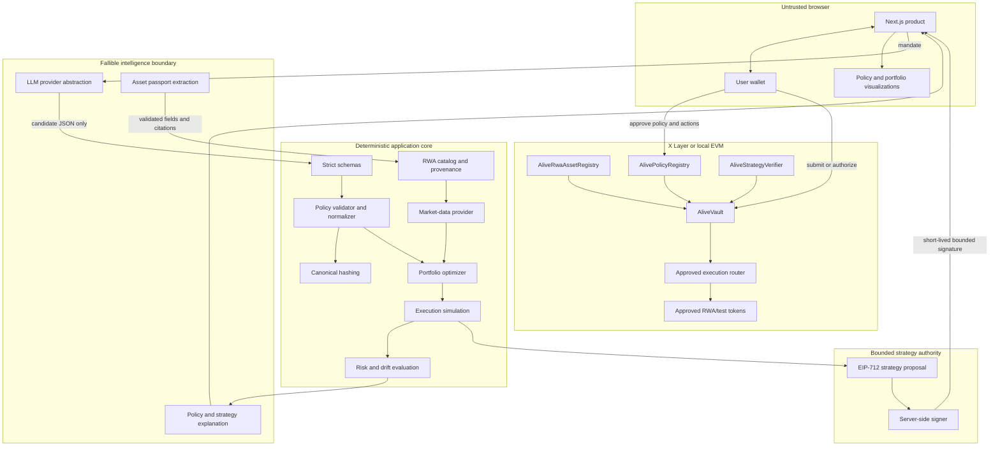
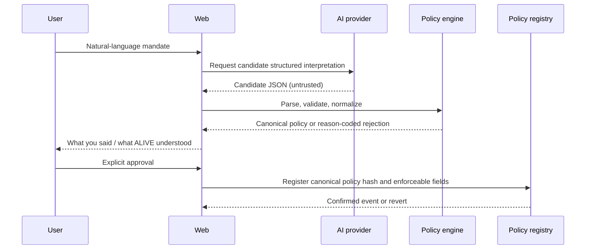
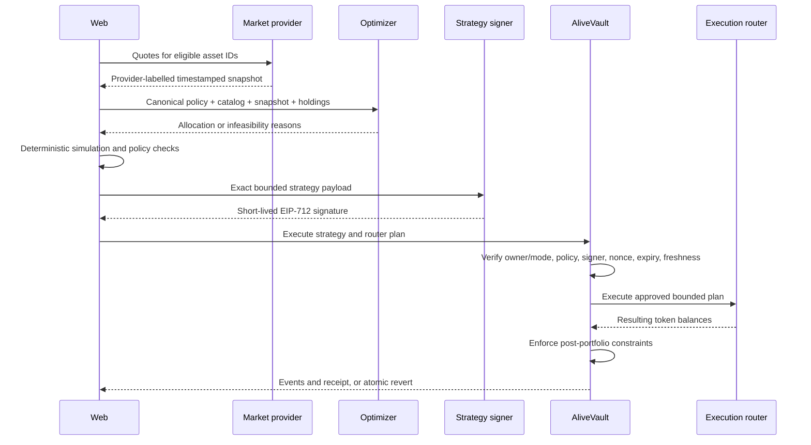

# ALIVE architecture

Status: **V2 pivot in progress**

This document describes the target architecture and the parts that are being
implemented on `feat/rwa-intelligence-pivot`. It does not claim a complete RWA
runtime, deployed vault, live market feed, or LLM integration.

## Objective

ALIVE turns a user's natural-language financial mandate into an enforceable
policy for tokenized real-world assets. Probabilistic interpretation is kept
separate from deterministic validation, portfolio calculation, authorization,
and contract execution.

The invariant is:

```text
user mandate
-> candidate interpretation
-> strict validation and normalization
-> canonical policy hash
-> sourced market snapshot
-> deterministic portfolio proposal and simulation
-> user approval or bounded strategy authorization
-> vault enforcement
-> execution outcome
```

An AI explanation is not a policy. A frontend pass badge is not contract
enforcement. A transaction request is not an execution result. Each boundary
must preserve the exact inputs needed to reproduce and audit the decision.

## Trust language

ALIVE surfaces four different kinds of information:

| Kind         | Source of truth                                                      |
| ------------ | -------------------------------------------------------------------- |
| AI opinion   | Model output after schema validation; always fallible                |
| Policy rule  | User-approved canonical policy and deterministic validator           |
| Market data  | Provider-labelled observation with provenance, timestamp, and status |
| Onchain fact | Contract storage, emitted event, verified receipt, or reverted call  |

These categories must not be merged into one generic "AI result."

## Target system map



## Current monorepo boundaries

### `apps/web`

The web app owns interaction and presentation, not financial or protocol truth.
The V2 surface is expected to provide mandate entry, policy review, asset
discovery, provenance-aware passports, portfolio simulation, vault state,
policy attacks, and drift/rebalance workflows.

Wallet operations continue through wagmi and viem. Every action must show its
actual state: disconnected, awaiting signature, simulating, submitted,
confirmed, reverted, stale, or unavailable. Demo data and unconfigured services
must be labelled rather than replaced with fabricated success.

The existing V1 camera, verification, and physical escrow routes are legacy
surfaces during the transition. They must not remain in primary V2 navigation.

### `packages/shared`

Shared code is the compatibility boundary between UI, deterministic services,
tests, and contracts. The pivot is adding strict definitions for:

- RWA assets, issuers, asset classes, restrictions, and field-level sources;
- market quotes and canonical market snapshots;
- portfolio policies expressed in integer basis points;
- allocations and deterministic policy-check reason codes;
- strategy proposals bound to a vault, policy, portfolios, market data, nonce,
  issuance time, and expiry.

Canonical encodings must reject ambiguous or non-finite values. Hash vectors
must be tested across TypeScript and Solidity before public deployment.

#### Canonical V1 commitments

`packages/shared/src/policy.ts` normalizes policy identifiers and class limits
before hashing. Asset-class limits use the fixed enum order `CASH`, `TREASURY`,
`EQUITY`, `ETF`, `GOLD`, `COMMODITY`, `CREDIT`, `FUND`; asset and issuer lists
use code-unit order and reject duplicates/conflicting allow/block entries.

The policy hash is an EIP-712-style struct hash, not a JSON hash. Each class
limit is ABI-encoded with its type hash, enum code, minimum BPS, and maximum
BPS. String-array elements are UTF-8 Keccak hashes. Each normalized array is
represented by the Keccak hash of its concatenated element hashes. The final
policy struct uses fixed Solidity-width fields and those five array hashes.

Market quotes likewise normalize fixed-decimal strings, sort by asset ID, hash
provider/status/data-mode/timestamps and optional bid/ask/mid fields, then bind
the concatenated quote hashes into `MarketSnapshot(version, dataMode,
capturedAt, quotesHash)`. The strategy references that exact snapshot hash.

The V2 strategy EIP-712 domain is `ALIVE RWA Strategy`, version `1`, bound to
the active chain and `AliveStrategyVerifier`. Its exact primary value is:

```text
Strategy(
  address vault,
  bytes32 policyHash,
  bytes32 portfolioBeforeHash,
  bytes32 portfolioAfterHash,
  bytes32 marketSnapshotHash,
  bytes32 executionPlanHash,
  bytes32 strategyNonce,
  uint64 marketTimestamp,
  uint64 issuedAt,
  uint64 expiresAt
)
```

The TypeScript constants and Solidity tuple/hash parity tests are normative;
this prose is explanatory and must be updated with either side.

### `packages/policy-engine`

The policy engine provides a deliberately bounded deterministic parser for the
documented demo mandates. It produces a normalized policy, policy hash,
explanation fields, warnings, and reason-coded validation failure. It is a
zero-cost development fallback and is explicitly labelled
`DETERMINISTIC_FALLBACK`; it is not represented as AI or as a general natural-
language understanding system.

The policy engine's five focused tests and the shared package's 37 tests pass.
Real-model compilation and the user approval UI remain separate integration
gates.

### `packages/market-data`

The provider interface separates product logic from a data source. The first
required implementation is a zero-cost demo provider with explicit synthetic
or dated values. Every quote carries provider, observation time, age/status,
and enough identity to bind it into a snapshot.

A Chainlink Data Streams adapter is optional and server-side. It must use only
fields returned by the selected official stream and must fail closed when data
is stale or credentials are absent. No paid provider is required for local MVP
operation.

The package currently passes typecheck, build, and eight tests. Those tests
cover demo labelling, Chainlink V3/V10 normalization, market status, negative
and unsupported reports, configuration, and fail-closed credentials. They use
fixtures/test clients; no live provider call or production feed mapping is
claimed.

### `packages/optimizer`

The optimizer receives a validated policy, eligible catalog assets, market
observations, and optional current holdings. It returns either:

- a deterministic allocation totaling exactly `10_000` BPS plus an explanation
  trace; or
- an infeasibility result with machine-readable violated constraints.

The LLM does not choose weights. The engine owns rounding correction, class and
issuer caps, single-asset caps, cash floors, allow/block lists, risk/liquidity
eligibility, and turnover penalties. Tests must prove no negative or non-finite
weights and stable output for stable input.

The package currently passes typecheck, build, and five tests covering stable
feasible allocation, infeasibility, stale/halted/illiquid exclusions, invalid
allocation input, drift, and explicit buy/sell rebalance deltas. This is a
deterministic application foundation, not a complete financial risk model or
onchain execution proof.

### `services/intelligence`

The tested Fastify service supports `ollama`, `openai-compatible`, and
`disabled` provider modes. Its output is always candidate data. The pipeline
is:

```text
user text
-> model candidate JSON
-> strict schema
-> semantic validator
-> normalizer
-> canonical policy
-> user review
```

If no provider is configured, the product must say `AI COMPILER OFFLINE`. A
deterministic fixture parser may support tests but may not be labelled as AI.

Asset-passport extraction follows the same rule: source material in, strict
structured fields plus citations out, and `UNKNOWN` for unsupported facts.

The current routes expose health, catalog/list and asset detail, market data,
policy compile/read/check, portfolio optimization, and rebalance proposal. A
versioned SQLite migration creates the 12 MVP domain tables. Typecheck, build,
and four tests pass, including a Fastify compile -> optimize -> rejected
100%-single-asset policy check -> rebalance path through real application code.
That test does not invoke a production LLM, live market provider, wallet, or
contract.

### `packages/contracts`

The locally compiled and tested V2 contract design consists of:

- `AliveRwaAssetRegistry`: minimal approved-token, asset-class, issuer, status,
  metadata-commitment, and provenance-commitment records;
- `AlivePolicyRegistry`: owner/vault-bound canonical policy versions and a
  directly enforceable V1 policy subset;
- `AliveStrategyVerifier`: EIP-712 strategy validation, context binding,
  signer authorization, freshness/expiry, nonce, and replay protection;
- `AliveVault`: user custody, bounded deposits/withdrawals, simulation-aligned
  execution through an approved router, and post-execution policy checks;
- `MockRwaToken` and `MockRwaRouter`: test-only six-decimal assets and controlled
  execution for local/testnet demonstrations.

The RWA-focused file has 20 passing tests and the preserved V1 file has 31
passing tests, for 51 passing cases across the two completed file-level runs. A
fresh local demo-stack deployment smoke also completed. This is **not a public
deployment or external audit**.

The current design intentionally lets the vault owner withdraw without an
allocation-policy check so policy cannot trap the owner's funds. An owner-key
compromise therefore remains total custody compromise. Tokens sent directly to
the vault cannot be prevented; they become part of the next complete portfolio
snapshot. Execution plans are bounded to 32 positions, while registry and
position scans still need a production gas/scalability review.

### `services/verifier`

The Fastify physical-image verifier is V1 legacy code. It remains useful as a
historical regression and as a source of patterns for strict parsing,
capabilities, SQLite migrations, EIP-712 signing, and fail-closed behavior. It
is not the V2 RWA intelligence service and must not be presented as one.

### `videos/alive-launch`

The existing Remotion composition tells the V1 physical-camera story. Preserve
it through the archive checkpoint. A V2 composition should be rebuilt only
after mandate compilation, deterministic allocation, real policy rejection,
and valid execution are working.

## Policy lifecycle



Impossible lower bounds, unsupported asset classes, invalid BPS ranges, and
contradictory allow/block lists fail before approval. The onchain enforceable
fields must correspond to the exact approved policy hash.

## Proposal and execution lifecycle



The vault must not sign or execute arbitrary calldata supplied by an LLM. The
router and tokens are allowlisted, and the post-execution allocation is checked
from actual balances rather than trusted frontend projections.

## Policy attack path

A request such as `put 100% into tNVDA` may reach the interpretation and
proposal layers. It must then fail deterministic checks and, if deliberately
submitted as an adversarial test, revert at the vault for a real policy reason.

Attack scenarios include single-asset concentration, same-issuer
concentration, unapproved assets, stale market data, wrong policy/vault binding,
expired strategy, wrong signer, replay, slippage, and malicious router/token
behavior. Each UI scenario requires an automated underlying test.

## Drift and rebalance

Drift evaluation recomputes portfolio weights from current holdings and a fresh
market snapshot. A price change can make a previously valid portfolio violate
policy without any trade. The deterministic engine should return the violated
rule and the minimum-turnover valid rebalance. AI may explain that result but
may not alter its arithmetic.

## Persistence target

The V2 durable model is planned to include assets, field-level sources, market
quotes and snapshots, policies and versions, portfolio proposals, vaults,
holdings, strategy proposals, executions, and risk snapshots. SQLite remains a
reasonable local MVP store. Migrations, retention, access control, and backup
behavior are not yet complete for this model.

## Network configuration

Chain definitions remain centralized in `packages/shared/src/chains.ts`, with
contract network settings in `packages/contracts/hardhat.config.ts`.

| Environment     | Chain ID | Role                                                   |
| --------------- | -------: | ------------------------------------------------------ |
| Local Hardhat   |    31337 | Deterministic development and adversarial tests        |
| X Layer Testnet |     1952 | Intended public V2 demo; no V2 deployment recorded     |
| X Layer Mainnet |      196 | Configuration only; prohibited before audits/hardening |

RPC and explorer values must be checked against current official X Layer
documentation before deployment. The historical V1 `AliveAssetRegistry`
address on testnet is not a V2 protocol deployment.

## Current trust boundaries and gaps

- AI output remains untrusted even when it validates structurally.
- Asset metadata and market data are only as reliable as their cited providers.
- Demo market values are not live and cannot support investment decisions.
- A single strategy signer is a centralized trust point until bounded signer
  rotation, operational controls, and possibly quorum are implemented.
- Registry/policy administration can emergency-disable entries and is a
  centralized trust point until production role governance is defined.
- The mock router uses administrator-set synthetic prices. It is not a DEX,
  oracle, or production execution adapter.
- Smart contracts can enforce encoded rules but cannot establish that an RWA
  issuer, price feed, legal claim, or redemption promise is truthful.
- The optimizer and canonical encodings require independent review and
  cross-language vectors.
- V2 contracts are unaudited and not publicly deployed.
- The database, monitoring, drift loop, and execution adapter are incomplete.
- There is no vault factory, upgrade design, or production router adapter.
- No end-to-end V2 browser-to-X-Layer receipt chain is recorded.

See [SECURITY.md](SECURITY.md) and [BUILD_STATUS.md](BUILD_STATUS.md) for the
threat model and current evidence.

## Historical V1 architecture

The full Proof-of-Physical-State source and architecture are preserved at tag
`v0.8.1-physical-state-archive` (`bf449f6`). The historical factual audit is
retained in [BUILD_STATUS.md](BUILD_STATUS.md#historical-v1-physical-state-audit).
Legacy [API.md](API.md), [SCORING.md](SCORING.md), and [DEMO.md](DEMO.md) describe
that archived product and are not the V2 product contract.
