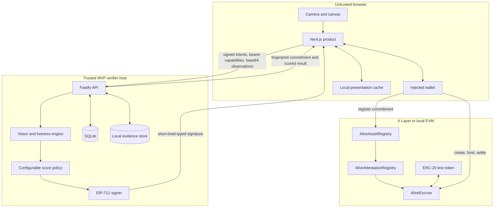
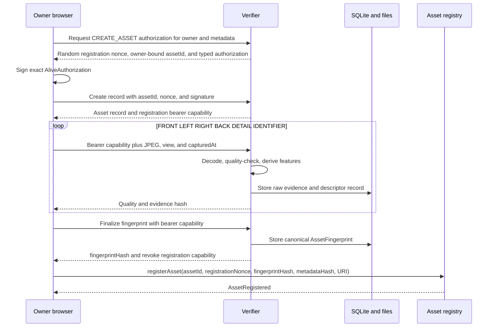
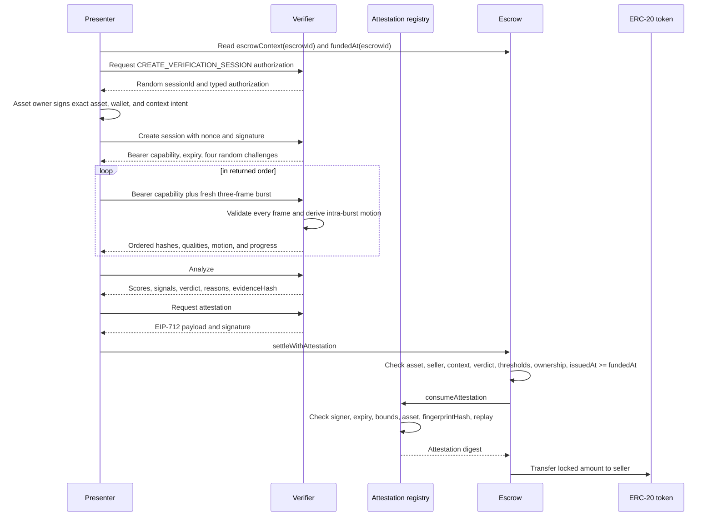

# ALIVE architecture

## Objective

ALIVE converts an observable camera presentation into a short-lived, signed statement that an EVM contract can validate. The protocol deliberately separates private evidence, probabilistic computation, cryptographic authorization, and deterministic payment logic.

The invariant is:

```text
physical capture -> real visual analysis -> signed attestation -> contract validation -> payment outcome
```

Removing any link changes the product. A frontend animation is not evidence, a score without a signature is not an oracle result, and a signature that is not consumed by a contract is not settlement.

## System map



## Monorepo boundaries

### `apps/web`

The web app owns interaction, not protocol truth. It provides:

- eight-stage registration with six guided views;
- camera permission, device selection, client-side quality feedback, and three-frame challenge bursts;
- verification and transaction state machines;
- injected-wallet connection and chain switching through wagmi and viem;
- direct reads and writes to deployed contracts;
- deterministic fingerprint visuals, lazy React Three Fiber scenes, reduced-motion and non-WebGL paths;
- dashboard, passport, Attack Lab, protocol explorer, design-system, and presentation routes.

The browser stores recent asset and verification summaries in `localStorage` for presentation continuity. SQLite and the chain remain authoritative. Local mode creates an EVM key in `sessionStorage`, uses it to sign the same typed authorization as an injected wallet, and exposes only its address to the verifier. That ephemeral identity can own and reverify an offchain record within the browser session, but it cannot register or settle onchain as a different connected wallet. Resource capabilities remain in component memory rather than durable browser storage.

### `services/verifier`

The verifier is a Fastify service bound to loopback by default. It owns:

- strict Zod request parsing and bounded image bodies;
- short-lived EIP-712 wallet authorization for asset and verification-session creation;
- random resource-scoped bearer capabilities whose Keccak hashes, not plaintext values, are persisted;
- SQLite migrations and state transitions;
- local filesystem evidence storage through an adapter;
- image decoding and normalization with Sharp;
- quality, spatial, gradient, perceptual-hash, OCR, and optional neural features;
- random ordered challenges, capture freshness, session expiry, and one-time analysis;
- transparent score calculation and machine-readable reason codes;
- canonical evidence commitments;
- server-only EIP-712 signing.

The verifier process is trusted in this MVP. It is not a decentralized oracle network.

### `packages/shared`

Shared code is the compatibility layer across browser, verifier, tests, and contracts:

- `schemas.ts`: exact runtime schemas and TypeScript types;
- `canonical.ts`: deterministic sorted-key JSON and Keccak commitments;
- `scoring.ts`: basis-point thresholds and signal weights;
- `attestation.ts`: the exact EIP-712 domain, field order, digest, signer recovery, and escrow-context helper;
- `authorization.ts`: the wallet-authorization domain, exact request hashes, typed data, and signer recovery;
- `chains.ts`: local, X Layer Testnet, and X Layer Mainnet definitions.

### `packages/contracts`

- `AliveAssetRegistry` derives the immutable asset ID from owner plus signed registration nonce, then stores its current owner, fingerprint hash, metadata hash, optional public metadata URI, and registration timestamp. It supports owner-authorized transfer and never stores captures or vectors.
- `AliveAttestationRegistry` validates one authorized EIP-712 signer, registered asset existence, exact equality between signed and registered fingerprint commitments, score bounds, timestamps, maximum lifetime, signature, subject or consumer authorization, and global session replay. It supports owner-controlled verifier rotation and consumer authorization.
- `AliveEscrow` binds settlement to the exact asset, seller, escrow-derived context, verdict, identity threshold, and liveness threshold. It rechecks seller ownership at creation, funding, and settlement and rejects attestations issued before `fundedAt`. Funding and outgoing payout both use exact recipient balance accounting; settlement consumes proof and transfers tokens atomically.
- `MockUSDT` is a six-decimal, owner-mintable, one-faucet-per-address test token. It is not USDT and has no value.

## Registration sequence



The verifier requires `FRONT`, `LEFT`, `RIGHT`, `BACK`, and `DETAIL`; `IDENTIFIER` is optional at the schema boundary but required by the current product wizard. Raw frames and derived arrays stay offchain.

The fingerprint commitment is:

```text
keccak256(UTF8(canonicalJson({ commitmentVersion: 1, value: fingerprint })))
```

Canonical objects use lexically sorted keys, arrays preserve order, and ambiguous values such as `undefined` or non-finite numbers are rejected.

## Verification and settlement sequence



Any caller may submit settlement, but payment can only go to the recorded seller. An invalid or below-threshold proof reverts and leaves escrow state and token balance unchanged.

## Vision pipeline

Every accepted frame is normalized to 192 by 192 pixels. The baseline implementation extracts:

1. blur and exposure quality;
2. a 4 by 4 spatial grid of eight-bin RGB histograms;
3. a 6 by 6 grid of eight-bin gradient orientations;
4. a 64-bit difference hash;
5. normalized OCR tokens when enabled;
6. a cached neural embedding when enabled and available.

For each observation, candidate registration views receive spatial, local, optional neural, and perceptual-hash similarity. A combined candidate score helps choose the corresponding baseline view. The final policy then uses the explicit signals documented in [SCORING.md](SCORING.md).

The current implementation is instance-matching evidence, not 3D reconstruction and not certified authenticity. Similar, visually uniform products remain difficult unless they expose stable identifiers or distinctive wear.

## Liveness and replay resistance

Sessions use `node:crypto` randomness for the session ID, nonce, challenge IDs, and shuffled challenge order. Defaults are:

- four challenges per session;
- five-minute session TTL;
- five-minute attestation TTL;
- ordered, one-burst-per-challenge acceptance;
- exactly three frames with strictly increasing client timestamps across no more than five seconds;
- freshness and quality checks on every frame against server receipt and session expiry;
- ordered storage of all raw frames, evidence hashes, and frame fingerprints;
- motion scoring primarily from intra-burst change, conservatively combined with cross-challenge motion;
- duplicate evidence hashes and high perceptual-hash similarity as replay risk;
- global onchain consumption of a session ID.

The three-frame burst is part of the server-validated evidence contract, not only client feedback. It makes a motionless repeated still fail more reliably, but a synchronized display, relay, generated sequence, or camera injection can still defeat a camera-only MVP.

## Wallet-authorization compatibility contract

Asset and verification-session creation use a separate EIP-712 domain from verifier attestations:

```text
name: ALIVE Verifier Authorization
version: 1
chainId: ALIVE_AUTH_CHAIN_ID
```

Exact primary type:

```text
AliveAuthorization(
  string audience,
  string action,
  address wallet,
  bytes32 resource,
  bytes32 context,
  bytes32 payloadHash,
  bytes32 nonce,
  uint64 issuedAt,
  uint64 expiresAt
)
```

The verifier generates `resource` and `nonce`. For `CREATE_ASSET`, the nonce is
also the registration nonce and the resource is derived as
`keccak256(abi.encode(owner, nonce))`; the payload hash commits to that ID,
owner, and strict metadata. The browser later supplies the same signed nonce to
`registerAsset`, so another caller cannot claim the authenticated offchain ID.
For `CREATE_VERIFICATION_SESSION`, the resource is a random session ID and the
payload hash commits to that ID, asset, wallet, and context. The service checks
the configured audience and chain, recovers the wallet signer, and consumes the
nonce atomically with resource creation.

## EIP-712 compatibility contract

Domain:

```text
name: Alive Protocol
version: 1
chainId: active EVM chain
verifyingContract: AliveAttestationRegistry address
```

Exact primary type:

```text
Attestation(
  bytes32 assetId,
  bytes32 fingerprintHash,
  bytes32 sessionId,
  address subject,
  bytes32 context,
  uint16 identityScore,
  uint16 livenessScore,
  uint16 integrityScore,
  bool verified,
  bytes32 evidenceHash,
  uint64 issuedAt,
  uint64 expiresAt
)
```

All three scores cross the chain boundary as integers from 0 through 10,000. `fingerprintHash` is copied from the finalized offchain asset record into the signature; the attestation registry compares it with `AliveAssetRegistry.getAsset(assetId).fingerprintHash` before consuming the session. Escrow context is exactly:

```solidity
keccak256(abi.encode(aliveEscrowAddress, escrowId))
```

Standalone attestations use zero context and can only be submitted by their signed subject. Nonzero-context proofs can only be consumed by an owner-authorized contract, and that consumer must validate its own context before calling the registry.

## Persistence model

SQLite persistence contains:

- `assets`;
- `registration_captures`;
- `fingerprints`;
- `verification_sessions`;
- `verification_challenges`;
- `verification_captures`;
- `attestations`;
- `wallet_authorizations` with one-time nonces and consumed timestamps;
- resource capability hashes and expiry fields on assets and verification sessions.

Migration v3 adds `evidence_paths_json`, `evidence_hashes_json`, `burst_fingerprint_json`, and `intra_challenge_motion` to each verification-capture row. Registration captures persist one frame. Each verification capture persists the ordered paths, evidence hashes, and fingerprints for all three burst frames plus derived intra-challenge motion. Large raw frames remain in the filesystem adapter and are referenced by path and evidence hash. `storage/database/**` and `storage/evidence/**` are ignored except for `.gitkeep`. An object-storage or encrypted adapter can replace the local store without changing onchain formats.

## Trust boundaries and known gaps

- Asset creation and verification-session creation require one-time EIP-712 authorizations bound to the exact action, wallet, resource, context, canonical payload hash, audience, chain, nonce, and expiry. Session creation additionally requires the authenticated offchain asset owner.
- Follow-up mutation and session-read routes require a resource-scoped bearer capability. Only its Keccak hash is stored. Registration capability is revoked at finalization; session capability expires with the session.
- Asset-list and individual-asset reads plus authorization-challenge issuance remain public to the local service. Allowed browser origins are restricted by `VERIFIER_ALLOWED_ORIGINS`, but origin filtering is not authentication.
- The verifier key and host are trusted. Compromise permits forged results until signer rotation.
- Local evidence is not encrypted and has no production retention policy.
- The verifier signs its finalized local `fingerprintHash`; the attestation registry enforces exact equality with the current onchain commitment when the proof is consumed. A signature may still be issued for an offchain-only asset, but it cannot pass registry consumption until the identical asset and commitment exist onchain.
- The chain validates signatures and policy, not the truthfulness of the camera or model.
- Contract source is unaudited and no public deployment is currently recorded.

See [SECURITY.md](SECURITY.md) for the full threat model.

## Network configuration

Chain definitions live in `packages/shared/src/chains.ts`; contract RPC configuration lives in `packages/contracts/hardhat.config.ts`. Browser components consume the centralized `activeChain` and explorer helpers rather than scattering links.

| Environment      | Chain ID | Native gas | Default RPC                           |
| ---------------- | -------: | ---------- | ------------------------------------- |
| `local`          |    31337 | ETH        | `http://127.0.0.1:8545`               |
| `xlayer-testnet` |     1952 | OKB        | `https://testrpc.xlayer.tech/terigon` |
| `xlayer-mainnet` |      196 | OKB        | `https://rpc.xlayer.tech`             |

Public addresses are always environment-driven. Mainnet support is configuration only and must not be used before audit and operational hardening.

## Toolchain decision

Hardhat 2 is the supported compiler, local node, test runner, and deployment tool for this Windows workspace. Solidity `0.8.24`, optimizer runs `200`, `viaIR`, and EVM target `paris` are fixed in configuration. A Foundry-compatible `foundry.toml` remains for environments with Forge, but a Hardhat pass does not imply Forge was executed.
